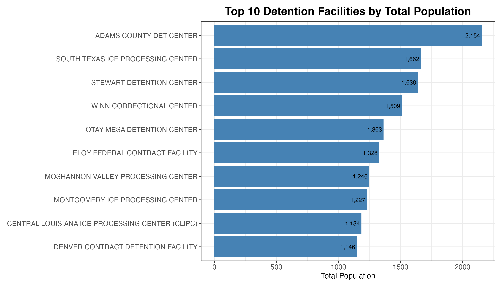

# Data Screening Exercise

## Overview

This project involves cleaning and analyzing a dataset related to ICE Detention Facilities. The goal is to clean the data, handle missing or invalid entries, and perform basic exploratory data analysis (EDA) to visualize the top 10 facilities by total population.

## Getting Started

### Requirements

To run this project, you'll need the following packages in R:

- `dplyr` (Used for: Data manipulation. Your code uses dplyr functions like:
  - `mutate()` – to create or transform columns (e.g., cleaning `Name`, `City`, etc.)
  - `filter()` – to keep only rows meeting certain conditions (problematic_rows))
- `ggplot2` (Used for: Data Visualization)
- `stringr` (Used for: String manipulation. Your code uses:
  - `str_replace_all()`, `str_trim()`, `str_squish()` – to clean up text columns
  - `str_detect()` – to identify problems like special characters)
- `lubridate` (Used for: Date manipulation. Your code uses:
  - `mdy()` – to convert dates in mm/dd/yyyy format
  - `as.Date()` – to convert Excel-style numeric dates)

You can install them using the following commands in your R console:

```r
install.packages("dplyr")
install.packages("ggplot2")
install.packages("stringr")
install.packages("lubridate")
```

### Data

The data is in the `messy_ice_detention.csv` file, which should be placed in your working directory. The dataset contains information about ICE detention facilities, including:

- Facility Name
- City
- State
- Various population levels
- Last Inspection End Date

### Cleaning Steps

1. **Remove Initial Metadata Rows**: The first six rows are removed, as they contain metadata rather than actual data.
2. **Handling Special Characters and Encoding**: Cleaned Name, City, and State columns by removing unwanted special characters, trimming extra spaces, and only stripping unmatched parentheses while preserving valid paired ones.
3. **Handling Missing or Invalid Data**: The script checks for missing or invalid data (e.g., NA, empty strings, "n/a") in the `Name`, `City`, and `State` columns. Based on certain conditions, missing values are replaced. For example:
  - If City is "ELK RIVER" and State is "MN" with a missing Name, it is replaced with "Sherburne County Jail".
  - Similarly, for "DOVER" in NH, Name is updated to "Strafford County Corrections".
4. **Handling Inspection Date Format**: The `Last Inspection End Date` column is standardized and invalid or empty values are replaced with `NA`. This code snippet processes the Last Inspection End Date column to standardize date formats and handle missing or invalid values:
  - **Remove invalid entries**: Any entries like "na", "n/a", empty strings, or "null" are replaced with `NA`.
  - **Convert date formats**: 
    - Dates in MM/DD/YYYY format are converted using `mdy()` (from the `lubridate` package).
    - Dates in 5-digit Excel date format are converted into `Date` type, assuming they represent dates from the 1900s.
  - **Standardize date format**: It ensures that all valid date entries are converted into `Date` format.
5. **Level Columns**: Before calculating, the level columns (`Level A`, `Level B`, `Level C`, and `Level D`) are converted to numeric. Missing or invalid values are handled.

### Data Analysis

The dataset is analyzed to find the **top 10 facilities by total population**. The total population for each facility is first calculated by summing the `Level A`, `Level B`, `Level C`, and `Level D` columns. A new column, `Total Population`, is created to store this sum. The data is then sorted in descending order by total population, and the top 10 facilities are selected. The resulting data is stored in the `top_10_facilities` variable.

### Visualization

The top 10 detention facilities are visualized with a horizontal bar chart, where the facility names are displayed along the y-axis and the total population on the x-axis. The chart also includes text labels indicating the population of each facility.



### How to Execute

1. Install the required R packages.
2. Place the `messy_ice_detention.csv` file in the same directory as the R script or Jupyter notebook.
3. Run the script or notebook to clean the data, perform analysis, and generate the chart.

### Interpretation

The final bar chart visualizes the top 10 detention facilities with the highest total population. This information can be used to further explore trends in facility sizes, determine potential correlations, or identify outliers in the dataset.

## Data Source

The data source for this project is the "messy_ice_detention.csv" file, which contains raw data about various ICE detention facilities. The dataset includes facility names, cities, states, inspection dates, and population levels.

## Manual Changes and Corrections

- **Missing City and State Information**: Some entries required manual filling of missing city and state data based on the facility name.

## Code Autocomplete**: I used the [Windsurf Autocomplete](https://github.com/Windsurf/windsurf) AI to help with writing the code, particularly with generating the code for cleaning the date column. The AI was used to generate the following code blocks:
  - `converting Excel-style numeric dates`.